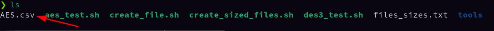

## Activity1:
* To make the tools diractory you can type the file sizes you want inside **files_sizes.txt** 
	
* then run `./create_sized_files.sh` 
	
* After that you can start benchmark AES and 3DES:
	* benchmarking AES: 
		- using the command `./aes_test.sh {filename} tools/`
			
		- the output file is going to be: **filename.csv**
			in this example is **AES.csv** 
		- than we can make a graph out of it:
			
		- as we can see **cbc** is faster
	* benchmarking 3DES:
		- using the command `3des_test.sh {filename} tools/`
			
		- and the output file is: **filename.csv** 
			in this example is **3DES.csv**
			
		- than we can make a graph out of that file too:
			
		- we can have the same conclustion **cbc** is faster than **ecb** 

## Activity2:

* you can put the names and passwords or the users on a txt file: 
	
* and put **name**,**password**  
	
	- for example username: **Abdelhak** and password: **Hunter** 
* then you can create the users with there passwords and the private and the public keys with the command: 
	- `sudo ./create_users.sh {filename}` in this case the filename is users.txt: `sudo ./create_users.sh users.txt` 
	
* and when we run `ll` on home diractory
	
	- we can see that the **PUBKEYS** don't have write permissions
	
	
